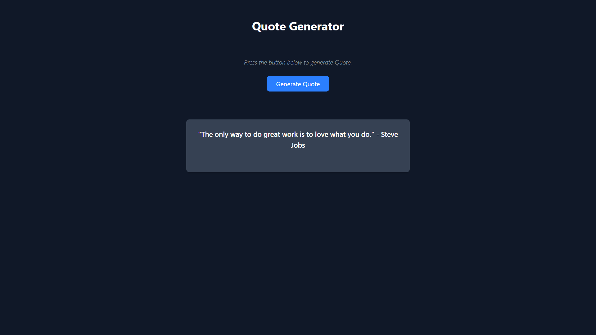

# 💡 AI Tip Generator

A simple **React + Vite + Tailwind** web app that generates daily tips using **OpenRouter’s GPT-3.5-Turbo API**.  
Includes a smooth **typewriter effect**, clean UI, and secure `.env` API handling.

---

## 🚀 Features
- ✨ Generate AI-powered tips instantly  
- 🎬 Typewriter effect for smooth text rendering  
- 🎨 Modern & responsive UI with TailwindCSS  
- 🔒 Secure API key management with `.env`  
- ⚡ Built with React + Vite for speed & simplicity  

---

## 🛠️ Tech Stack
- **React (Vite)** – frontend framework & bundler  
- **TailwindCSS** – styling & layout  
- **OpenRouter API (GPT-3.5-Turbo)** – AI tip generation  
- **Typewriter effect** – animated text output  

---

## 📦 Installation & Setup

1. **Clone the repo**
   ```bash
   git clone https://github.com/your-username/tip-generator.git
   cd tip-generator
2. Install dependencies
- npm install
3. Add environment variables
Create a .env file in the root and add:

- VITE_OPENROUTER_API_KEY=your_api_key_here

4. Run the app locally

- npm run dev

## 🌍 Deployment

[Live Demo](https://ai-quote-generator-react-tailwind.netlify.app/)

## 📸 Preview



## 🔮 Roadmap

 Add categories (productivity, health, learning, etc.)

 Copy-to-clipboard button for tips

 “Daily Lock” mode → one tip per day

## 📜 License
MIT License